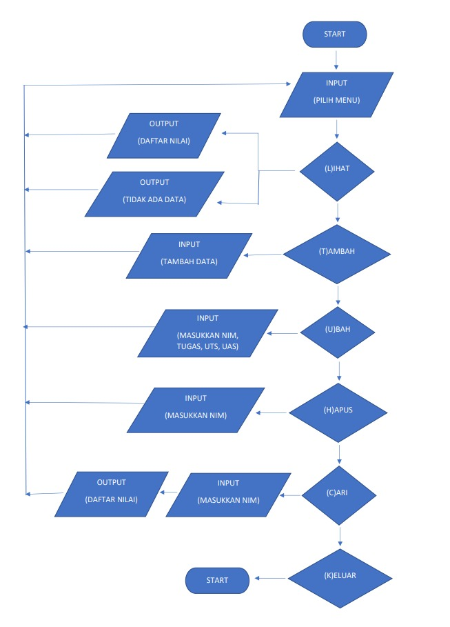

# Pertemuan 11

## Profil
| Variable | Isi |
| -------- | --- |
| **Nama** |Alvin alfandy |
| **NIM** | 312310473 |
| **Kelas** | TI.23.A.5 |
| **Mata Kuliah** | Bahasa Pemrograman |

### Latihan
## Ubah kode dibawah ini menjadi fungsi lambda

## setelah di ubah

## Outputnya

## Tugas Praktikum
*Buat program sederhana dengan mengaplikasikan penggunaan fungsi
yang akan menampilkan daftar nilai mahasiswa, dengan ketentuan:*
- Fungsi tambah() untuk menambah data
- Fungsi tapilkan() untuk menampilkan data
- Fungsi hapus(nama) untuk menghapus data berdasarkan nama
- Fungsi ubah(nama) untuk mengubah data berdasarkan nama
- Buat flowchart dan penjelasan programnya pada README.md

# Kode program 

### Penjelasan
- Pada dasar ny program ini sama seperti di Pertemuan-10, bedanya di program ini di tambahkan `Function` / Sub rutin. 
Seperti program ada di atas `def` yg berati definision, & contoh `def garis()` Untuk membuat fungsi garis yg di panggil dari `print("~"*80)`.

- Kalau `def tambah()`, `def ubah()`, `def hapus()`, `def cari()`, `def lihat()` di panggil dari program berikut :

## Outputnya 

### Tambah data

### Ubah data 

### Hapus data

### Cari data

## Lihat data

### Keluar

### Flowchart
